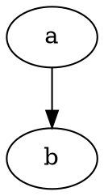
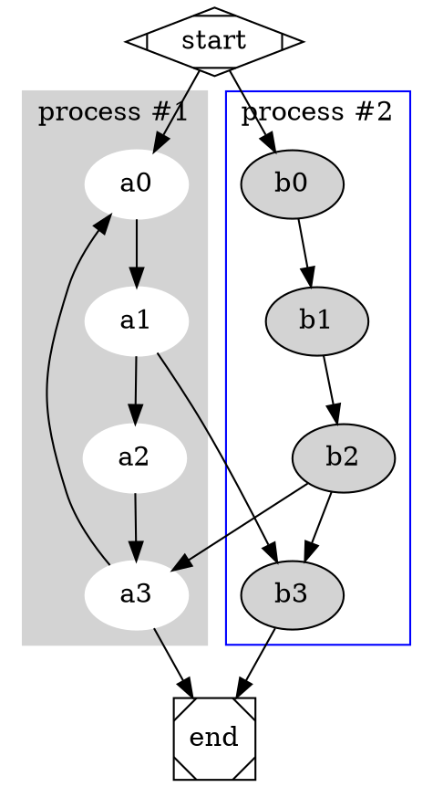

## Brief

[DOT](https://en.wikipedia.org/wiki/DOT_(graph_description_language)) is a graph description language from the Graphviz project. 

While Graphviz provides [a pretty-printing tool](https://graphviz.org/docs/cli/nop/), it lacks a minification tool. 

This tool minimizes .dot text to reduce data size.

## Run the program natively

> It takes input from **stdin** and outputs to **stdout**.

```bash
zig build -Doptimize=ReleaseSafe --release=small --summary all

zig-out/bin/dot-minify <<EOF
digraph G {

    // This is a comment
    splines = ortho

    a -> b;
}
EOF
```

stdout:



## Deploy .wasm to cloudflare workers

```bash
zig build -Doptimize=ReleaseFast -Dtarget=wasm32-wasi --summary all 

npx wrangler@wasm publish --compatibility-date 2024-11-18 --name my-wasi-app zig-out/bin/dot-minify.wasm
```

usage

```bash
curl https://my-wasi-app.my-workers-tenant.workers.dev -X POST -d @- <<EOF
digraph G {

  subgraph cluster_0 {
    style=filled;
    color=lightgrey;
    node [style=filled,color=white];
    a0 -> a1 -> a2 -> a3;
    label = "process #1";
  }

  subgraph cluster_1 {
    node [style=filled];
    b0 -> b1 -> b2 -> b3;
    label = "process #2";
    color=blue
  }
  start -> a0;
  start -> b0;
  a1 -> b3;
  b2 -> a3;
  a3 -> a0;
  a3 -> end;
  b3 -> end;

  start [shape=Mdiamond];
  end [shape=Msquare];
}
EOF
```

response.body



